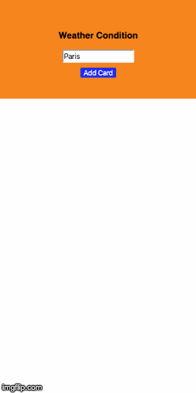

## Weather App
This project is a simple consultation weather responsive web app. 

This project was bootstrapped with [Create React App](https://github.com/facebookincubator/create-react-app).

## Setup on Terminal and Run Project Locally
```terminal
git clone https://github.com/felipeeu/challenge-previsao.git
cd challenge-previsao
npm install
npm start
```
## Demo


## Technologies Used
* JavaScript
* [ReactJS](https://reactjs.org/)
* [Styled-Compoents](https://styled-components.com/)
* [Axios](https://github.com/axios/axios)


## APIs Used
* [OpenWeather API](https://openweathermap.org/api) -  API Key is needed, but see [API guide](https://openweathermap.org/guide) to know how to get the API Key.


## License

The code in this project is licensed under the MIT License. See [LICENSE](LICENSE) for details.

Note that you will be responsible for following terms of service of the third party APIs used in the code. 


